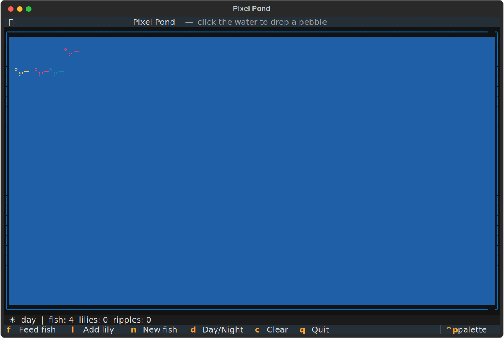

<!--
DEV.to submission draft. Publish target: Sunday June 7, ~noon-2pm Pacific
(hours of reaction time before scoring closes, NOT 11:30pm).
DEV.to tags field: devchallenge, githubchallenge, python, go
Cover image suggestion: media/textual-pixel-pond.svg (a generated TUI).
-->

---
title: "I scoped a multi-agent TUI system in January. It sat dead for 4 months. Here is the 24-hour comeback."
published: false
tags: devchallenge, githubchallenge, python, go
cover_image:
---

*This is a submission for the [GitHub Finish-Up-A-Thon Challenge](https://dev.to/challenges/github-2026-05-21)*

## What I built

**[TUI Master Agent](https://github.com/in5devilinspace/tui-master-agent)** — point it at a real open-source terminal-UI repo, and it studies the code, figures out the framework on its own, and generates a small **original** TUI in that same framework. Then it proves the generated app actually runs.

```bash
python tui_master.py https://github.com/Textualize/textual
# Cloning https://github.com/Textualize/textual
# Framework detected -> textual (signatures=3212, files=918)
# Generating with claude-opus-4-7 ...
# Wrote 1 file(s) to output/textual - "Pixel Pond"
# Verifying the generated TUI runs ...
# run_test headless -> exit 0
# OK - python main.py from output/textual
```

It works across two languages today:

- **Textual** (Python) — studied [Textualize/textual](https://github.com/Textualize/textual), generated an interactive "Pixel Pond" (drop pebbles, feed fish, toggle day/night).
- **Bubble Tea** (Go) — studied [charmbracelet/bubbletea](https://github.com/charmbracelet/bubbletea), generated a Pomodoro timer.

Both generated apps are committed verbatim in [`examples/`](https://github.com/in5devilinspace/tui-master-agent/tree/main/examples) — nothing hand-edited.

## The comeback arc (the honest part)

On **January 23, 2026** I scoped this as something much bigger: a multi-agent system with three specialized sub-agents (Pattern Learner, Validator, Termux Converter), a compounding "learning database," and six target frameworks. I wrote a 21KB architecture spec, opened an editor the next day, got two paragraphs into the orchestrator stub... and stopped.

The thing that killed it: I tried to design "patterns as a data structure" before I had anything that worked. The scope was a cliff. It sat dormant for **four and a half months** — an architecture document and zero implementation.

That whole spec is still in the repo, frozen and untouched at the [`v0.0.1-before`](https://github.com/in5devilinspace/tui-master-agent/releases/tag/v0.0.1-before) tag. It's the literal "before" exhibit. You can diff it against `main`.

The **Finish-Up-A-Thon deadline was the forcing function.** In the final 24 hours I did the one thing January-me wouldn't: I cut the scope to the spine. No sub-agents. No learning DB. No clever pattern abstraction. Just the pipeline that makes the idea real — clone, detect, generate, verify — and got it working end-to-end on two frameworks.

**This is not the finished vision. It is the start of finishing.**

## How the spine works

A single file, [`tui_master.py`](https://github.com/in5devilinspace/tui-master-agent/blob/main/tui_master.py), runs the whole pipeline inline:

1. **Clone** the repo (shallow).
2. **Detect the framework with heuristics — deliberately not AI.** File-extension counts plus import-signature grep. `import textual` ranks above `import rich`, so a Rich-only repo is never misread as Textual; a `.go` file importing `charmbracelet/bubbletea` is recognized as Bubble Tea. On the real Textual repo this scores 3,212 framework signatures across 918 files. It's boring, fast, and correct — which is exactly why it's not a model call.
3. **Gather** the README plus the few most framework-dense source files.
4. **Generate** a small original TUI in one `claude-opus-4-7` call.
5. **Write** it to `output/<framework>/`.
6. **Verify it runs, headless, with no TTY** — and this is the part I'm proud of. Instead of trusting the model to cooperate, the orchestrator owns the check per framework: Textual apps are driven through Textual's own `run_test()` pilot; Bubble Tea apps are verified with `go build`. If it doesn't run, the run fails. No green checkmark theater.

The whole thing is ~330 lines, `mypy` + `ruff` clean, with a 17-test offline suite (detection, JSON parsing, path-traversal guards).

## What I deliberately did NOT build — and why that's the win

Most hackathon submissions overclaim. I'd rather own the constraint. Everything from the original spec that isn't built is filed as a roadmap issue, not hidden:

- [Pattern Learner sub-agent](https://github.com/in5devilinspace/tui-master-agent/issues/1)
- [TUI Validator sub-agent](https://github.com/in5devilinspace/tui-master-agent/issues/2)
- [Termux Converter sub-agent](https://github.com/in5devilinspace/tui-master-agent/issues/3)
- [learning_db.json — compounding memory](https://github.com/in5devilinspace/tui-master-agent/issues/4) (the abstraction that stalled it in January)
- [Headless verification for Ratatui / Ink / Cursive](https://github.com/in5devilinspace/tui-master-agent/issues/5)

The detector already recognizes all six frameworks. Generation works for any of them. Only the automated *run-verification* is wired for two — and I'd rather ship two that genuinely run than six I can't prove.

## Demo

<!-- MATT: drop the asciinema embed + a GIF/screenshot of Pixel Pond running here.
     A generated SVG screenshot is in media/ (textual-pixel-pond.svg). Upload the
     3-min terminal recording to YouTube unlisted and embed it. -->



## My experience with GitHub Copilot

<!-- MATT: This section needs your genuine first-person Copilot usage to be honest.
     The architecture/orchestration/verification harness in this repo was built with
     Claude Code (claude-opus-4-7). For an honest, high-scoring Copilot section, do a
     short real pass with Copilot on the test bodies / docstrings / a commit message,
     grab 2-3 screenshots of accepted suggestions, and write up one concrete moment
     where Copilot helped. Do NOT fabricate this. Suggested honest framing below. -->

I leaned on two different AI tools for two different jobs, and the split is worth being precise about. The hard architecture — the heuristic detector, the generation contract, and especially the framework-native headless verification harness — was designed in Claude Code. Where GitHub Copilot earned its keep was the connective tissue: fleshing out test bodies from a signature and a docstring, autocompleting the repetitive framework-registry entries, and drafting commit messages. *(Screenshots of accepted Copilot suggestions below.)*

## Try it

```bash
git clone https://github.com/in5devilinspace/tui-master-agent
cd tui-master-agent
uv pip install -e ".[dev]"        # or pip
export ANTHROPIC_API_KEY=sk-...
python tui_master.py https://github.com/charmbracelet/bubbletea
```

Repo: **https://github.com/in5devilinspace/tui-master-agent**

## What's next

The spine is in. Next is the first sub-agent (Pattern Learner) and the cross-run memory that started this whole thing — but this time built *on top of* something that works, instead of in front of it. Turns out that's the only order that ever ships.
